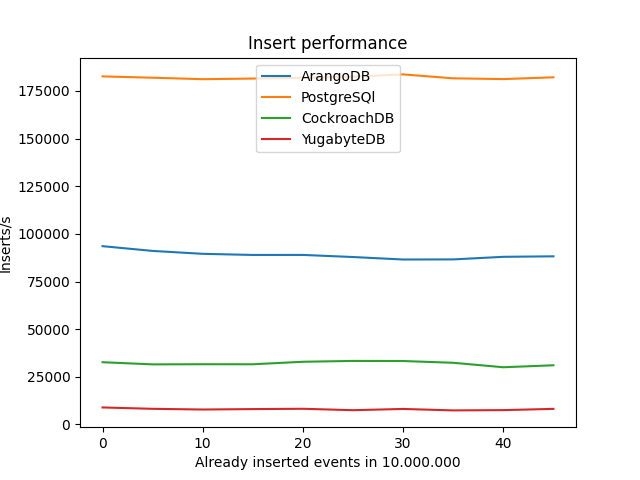

# Database performance comparison for IoT use cases

MaibornWolff does a lot of IoT projects. One important part of IoT projects is storage and analysis of device data/events. To get some reliable numbers to help us choose well suited databases for specific use cases, we have started to compare some horizontally scalable databases in regards to how well they handle typical IoT workloads and tasks. We are doing this test for us but maybe it's of interest to other people as well. This repository contains the results and the tooling for this comparison.

Currently we only have one use case: Rapid and concurrent inserts to simulate data ingestion of device events (to keep it simple we simulate temperature events). Other use cases like different queries are planned but not yet implemented. The initial idea was to see how the scalable SQL databases YugabyteDB and CockroachDB perform in those use cases but since we were already at it we threw in ArangoDB in the mix and might add more databases like TimescaleDB later.

**This is a work-in-progress and is neither intended nor designed as a complete or standardized benchmark like TPC.**

This readme contains three sections:

1. The test results
2. How can the tests be replicated / how to use the test tooling
3. Short note on how you can make changes to the tests

## Results

Using the test setup from this repository we ran tests against PostgreSQL, CockroachDB, YugabyteDB and ArangoDB with (aside from PostgreSQL) 1, 3 and 5 nodes and up to 16 parallel workers that insert data (more concurrent workers might speed up the process even more but we didn't test that as this test was only to establish a baseline). All tests were done on a k3s cluster consisting of 6 m5.2xlarge (8vCPU, 32gGiB memory) EC2 instances on AWS. In the text below all mentions of nodes refer to database nodes (pods) and not VMs or kubernetes nodes.

We ran the first set of tests with an initially empty database. The second set of tests look at how the insert rates change with an increasing fill level with up to 500 million database entries. We ran the tests with the increasing fill levels only with three node clusters (aside from PostgreSQL).

### Benchmark procedure

Upon execution the helm chart found in `deployment/` is installed on the cluster. By default we execute 3 runs per configured count of workers, the results noted below are the average value of the 3 runs. A run consists of the workers and one collector instance being spawned in individual pods inside the same k3s cluster. No pod affinities are configured, workers may be running on the same nodes as DB instances.
Each worker generates and writes the configured amount of events into the database. Event schemata and API usage are found in `/simulator/modules/{database_name}.py` (note: for cockroachdb and yugabytedb we use the postgres module), event generation logic may be reviewed under `/simulator/modules/event_generator.py`.
After each run the workers reports statistics to the collector instance. The database is wiped inbetween separate runs to have a reproducible baseline.

### Some observations

* The design of the primary key can have a huge impact on performance. For YugabyteDB speed drops to about one third when using a `SERIAL` primary key regardless of single or multi node linstances. This indicates that the implementation of that algorithm suffers from the multi node synchronization and has no shortcut for single node clusters. CockroachDB shows a speed drop of about 10% so it is measureable but not as extreme. PostgreSQL has no measureable change. The same is true for ArangoDB
* As expected when compared to single node instances multi node instances get a performance drop due to the needed synchronization and replication effort. This is most notable with YugabyteDB where the single worker insert speed drops from 1500 to 900. With an increasing number of workers this effect diminishes until it is no longer noticeable.
* Using more nodes than replicas will increase speed. This is most noticeable with YugabyteDB where the speed will increase from 3000 inserts/s with a 3 node cluster to 4200 inserts/s with a 5 node cluster and 3 replicas. For CockroachDB the effect is there but way less pronounced with 4000 vs 4500 inserts/s. ArangoDB shows no noticable increase for the same scenario.
* ArangoDB achieves much of its speed by doing asynchronous writes as a normal insert will return before the document has been fsynced to disk. Enforcing that via `waitForSync` will massively slow down performance from 4500 insert/s to about 1500 for a 3 node cluster. For a single node instance it is even more pronounced with 7000 vs 1000 inserts/s. As long as ArangoDB is run in cluster mode enforcing sync should not be needed as replication ensures no data is lost if a single node goes down.

#### Cassandra

* As designing a serial primary key for opposes the main concepts of Cassandra we omitted this step and always relied on a db-generated unique partition key (device_id, timestamp)
* Although the results of our benchmarks show a drastic improvement, batching in most cases is not a recommended way to improve performance when using Cassandra. The current results are based on a singular device_id (and thus partition key) per worker. This results in all batched messages being processed as one write operation. With multiple devices per batch statement load on the coordinator node would increase and lead to performance and ultimately stability issues. (See https://docs.datastax.com/en/cql-oss/3.3/cql/cql_using/useBatch.html) 
* async vs sync

### Batch inserts

For the insert testcase we use single inserts (for PostgreSQL with autocommit) to simulate an ingest where each message needs to be persisted as soon as possible so no batching of messages is possible. Depending on the architecture and implementation buffering and batching of messages is possible. To see what effect this has on the performance we have implemented a batch mode for the test.
For ArangoDB batch mode is implemented using the document batch API (`/_api/document`), the older generic batch API (`/_api/batch`) will be deprecated and produces worse performance so we did not use it. For PostgreSQL we implemented batch mode by doing a manual commit every x inserts. Another way to implement batch inserts is to use values lists (one insert statement with a list of values tuples). This mode can be activated by passing `--extra-option use_values_lists=true`.

For PostgreSQL using batch mode can increase the performance dramatically. With 16 workers and a batch size of 100 (so 100 inserts are accumulated until a commit is done) we achieved about 44000 inserts/s. Increasing the batch size further does not improve performance. With ArangoDB we achieved about 100000 inserts/s with a replication factor of 3 on a 3 node cluster, 16 workers and a batch size of 1000. Increasing the batch size further to 2000 does not seem to increase performance and even slow it down somewhat. Both CockroachDB and YugabyteDB actually get slower when using batch mode on single instance clusters. Using a 3 or 5 node cluster with CockroachDB will see a better performance in batch mode than without but way lower than PostgreSQL or ArangoDB, also increasing the batch size to 1000 seems to slow down the inserts.

Using values lists on PostgreSQL-compatible databases sees better performance than the batch mode using transactions. For PostgreSQL performance more than quadruples, YugabyteDB sees a tripling and CockroachDB close to an order of magnitude increase.

### Raw results starting with an empty database

All values as inserts per second. Average value of 3 runs. All runs were done with 1 million inserts per worker starting with an empty database.

#### Single-node database

|                                             | PostgreSQL | CockroachDB | YugabyteDB | ArangoDB | Cassandra sync | Cassandra async |
|---------------------------------------------|------------|-------------|------------|----------|----------------| ----------------|
| no batch, 16 workers, client-generated PK   |  12500     |  3850       | 2600       |   7000   |  -             | -               |
| no batch, 16 workers, db-generated PK       |  12500     |  3900       |  850       |   7000   |  -             | -               |
| batch 10, 16 workers, fastest PK mode       |  36900     |  3100       | 1600       |  51000   |  -             | -               |
| batch 100, 16 workers, fastest PK mode      |  44000     |  3730       | 2170       | 135000   |  -             | -               |
| batch 1000, 16 workers, fastest PK mode     |  44000     |  3830       | 2250       | 153000   |  -             | -               |
| values-lists 100 rows, 16 workers           | 190000     | 31000       | 6550       |          |  -             | -               |
| values-lists 1000 rows, 16 workers          | 175000     | 33000       | 7100       |          |  -             | -               |

#### Multi-node database

All results with 16 workers, client-generated primary key for YugabyteDB and db-generated for the others.

|                     | CockroachDB | YugabyteDB | ArangoDB |
|---------------------|-------------|------------|----------|
| 3 nodes, no batch   | 4200        | 2950       |   4500   |
| 5 nodes, no batch   | 4500        | 4270       |   4500   |
| 3 nodes, batch 100  | 5400        | 2180       |  83100   |
| 3 nodes, batch 1000 | 4600        | 2350       | 100000   |
| 5 nodes, batch 100  | 5860        | 2600       |  74000   |
| 5 nodes, batch 1000 | 5210        | 3650       |  95000   |

#### Multi-node database with increased resources

The results above were gathered with all the databases deployed with the default resource settings of their respective helm charts. As this would typically not be the deployment mode for a production installation we also ran the tests with the databases configured with more resources (for Yugabyte based on recommendations in their community slack). The values files in the `dbinstall` folder contain the increased settings commented out. These are the results:

|                     | CockroachDB | YugabyteDB | ArangoDB | Cassandra sync | Cassandra async |
|---------------------|-------------|------------|----------|----------------| ----------------|
| 3 nodes, no batch   |  5000       | 7180       |   6300   |  30000         | 97500           |
| 5 nodes, no batch   |  5000       | 8550       |   6300   |  -             | -               |
| 3 nodes, batch 100  | 14700       | 5270       |  95000   |  -             | 540000          |
| 3 nodes, batch 1000 | 14900       | 5640       | 110000   |  16611         | 540000          |
| 5 nodes, batch 100  | 15530       | 7000       |  80000   |  -             | -               |
| 5 nodes, batch 1000 | 15000       | 8000       | 101000   |  -             | -               |

CockroachDB and YugabyteDB benefit the most from more resources and can increase their performance in average by a factor of 2 to 3. ArangoDB also shows an increase but not as pronounced as the others. Not shown here are results for PostgreSQL which stay roughly the same.

### Fill level insert performance

As described in the run options, this test measures the performance of the databases with increasing table data fill levels. Depending on the database and taking spread into account, performance will dip a bit with higher fill levels but all in all remains quite stable. Tests were done with 16 workers and databases (except postgres) configured with 3 nodes (not configured with increased resource settings). Fastest mode was used (values-lists). We only tested with up to 500 million entries which is not much for an IoT project. If you are considering using one of these database you should run the tests with a realistic amount of data for your project.



## Requirements

* A kubernetes cluster (tested with k3s 1.19.3, any other should also work)
* Locally installed:
  * Python >= 3.8
  * kubectl
  * helm >= 3.4
  * Only tested on Linux, should also work on Mac, on Windows probably only with WSL

## Install database

You need a database to run the test against. To get you up and running quickly you can find below snippets to install databases using helm. Depending on what setup you want to test you need to edit the values files in `dbinstall/` to create a single or multi-node cluster. Depending on your cluster size and target workload you should also adapt the resource settings for each cluster.

Note: The provided values are for a k3s cluster. If you use another distribution or a cloud setup (e.g. EKS, AKS, GKE) please adapt them accordingly (at the minimum `storageClass`).

## Prepare the test

* Install the needed python dependencies: `pip install -r requirements.txt`
* If you use your own database installation or changed the provided ones edit `config.yaml`
  * Under `targets` edit the options for your database
  * if you want to use another kubernetes namespace than `default` set it there
* Make sure your local kubectl is configured and points to your cluster (Note: the `KUBECONFIG` environment override will currently not work correctly)

## Run the test

To run the test use `python run.py`. You can use the following options:

* `--target`: The target database to use (name must correspond to the target name in `config.yaml`). This is required
* `--workers`: Set of worker counts to try, default is `1,4,8,12,16` meaning the test will try with 1 concurrent worker, then with 4, then 8, then 12 and finally 16
* `--runs`: How often should the test be repeated for each worker count, default is `3`.
* `--primary-key`: Depending on the database using auto-generated primary keys (e.g. using the `SERIAL` type) can slow down the insert rate. Setting this to `db` means the database generates the primary key, setting it to `client` means the workers supply a `varchar` primary key that is calculated based on the message content
* `--tables`: To simulate how the databases behave if inserts are done to several tables this option can be changed from `single` to `multiple` to have the test write into four instead of just one table
* `--num-inserts`: The number of inserts each worker should do, by default 10000 to get a quick result. Increase this to see how the databases behave under constant load. Also increase the timout option accordingly
* `--timeout`: How long should the script wait for the insert test to complete in seconds. Default is `0`. Increase accordingly if you increase the number of inserts or disable by stting to `0`
* `--batch`: Switch to batch mode (for postgres this means manual commits, for arangodb using the [batch api](https://docs.python-arango.com/en/main/batch.html)). Specify the number of inserts per transaction/batch
* `--extra-option`: Extra options to supply to the test scripts, can be used multiple times. Currently only used for ArangoDB (see below)
* `--clean` / `--no-clean`: By default the simulator will clean and recreate tables to always have the same basis for the runs. Can be disabled
* `--prefill`: Setting this to a positive number will insert that number of events into the database before starting the run
* `--steps`: Test performance with increasing database fill levels. Specifies the number of steps to do

If the test takes too long and the timeout is reached or the script runs into any problems it will crash. To clean up you must then manually uninstall the simulator by running `helm uninstall dbtest`.

### Prefill

By default the simulator will clean and recreate tables to always have the same basis for the runs. But in reality it is interesting to see how databases behave if they already have existing data. This can be accomplished in two ways:

* Manually prepare data and then tell the simulator to not clean up the existing data via `--no-clean`. You can also use this way to gradually fill up the database by not cleaning between runs.
* Use the `--prefill` option to have the simulator insert some data before doing the timed insert test. Independent of the chosen options the prefill will always happen in batch mode to be as fast as possible.

### Fill level performance

By default the simulator will test performance on an empty table. But it is also interesting to see how insert performance changes when the database already has existing data. To test that usecase you can use the `--steps <n>` option. The simulator will do the insert test `n` times without cleaning the tables between tests thereby testing the insert performance on existing data. The following constraints apply: The worker set can only contain one worker count and the run count must be `1`.

Example run with PostgreSQL:

```bash
python run.py --target postgresql -w 16 -r 1 --num-inserts 3125000 --batch 1000 --steps 10 --extra-option use_values_lists=true
Stepsize: 50000000
    Level Inserts/s
        0 182620
 50000000 181920
100000000 181150
150000000 181480
200000000 181920
250000000 182480
300000000 183660
350000000 181600
400000000 181200
450000000 182130
```

Each run will insert `num-inserts * workers` events (in this example 50 million) and the simulator will print a table with the number of existing events (fill level) and the insert performance for the next step.

Note that the results will have some spread depending on the environment and database. In normal tests this is compensated by doing several runs and averaging the results. For the fill level test this is not possible so treat the results accordingly.

## Database specifics

### PostgreSQL

PostgreSQL is our baseline as the representitive of the classic SQL databases.

For the test we installed postgres using:

```bash
helm repo add bitnami https://charts.bitnami.com/bitnami
helm install postgres bitnami/postgresql -f dbinstall/postgresql-values.yaml
```

No other configuration / tuning was done.

### CockroachDB

CockroachDB is one of the representitives for distributed and scalable SQL databases with a postgres-compatible interface.

For the test we installed cockroachdb using:

```bash
helm repo add cockroachdb https://charts.cockroachdb.com/
helm install cockroachdb cockroachdb/cockroachdb -f dbinstall/cockroachdb-values.yaml
```

The values file as it is commited in git installs a 3 node cluster. To install a single node cluster change `statefulset.replicas` option and uncomment the `conf.single-node` option.

### YugabyteDB

YugabyteDB is one of the representitives for distributed and scalable SQL databases with a postgres-compatible interface.

For the test we installed yugabyteDB using:

```bash
helm repo add yugabytedb https://charts.yugabyte.com
helm install yugabyte yugabytedb/yugabyte -f dbinstall/yugabyte-values.yaml
```

The values file installs a 3 node cluster. To install a single node cluster change the `replicas` options. If you want more than 3 nodes you should set the `replicas.master` value to 3 and the `replicas.tserver` value to the node count you desire.

### ArangoDB

ArangoDB represents document databases without a fixed schema.

For the test we installed arangodb using:

```bash
export OPERATOR_VERSION=1.1.5
export URLPREFIX=https://github.com/arangodb/kube-arangodb/releases/download/${OPERATOR_VERSION}
helm install kube-arangodb $URLPREFIX/kube-arangodb-crd-${OPERATOR_VERSION}.tgz
helm install kube-arangodb-crd $URLPREFIX/kube-arangodb-${OPERATOR_VERSION}.tgz
kubectl apply -f dbinstall/arangodb-deployment.yaml
```

The values file installs a single node cluster. To install a 3 node cluster change `spec.mode` to `Cluster` and comment in the `spec.dbservers` options.

As a speciality for ArangoDB you can/must set extra options when running the test:

* `replication_factor`: By default this is set to `1`, to produce behaviour similar to the other databases in a cluster setting set this to `3`
* `shard_count`: By setting this option the collection will be created with the specified number of shards
* `sync`: By default the workers will not use the `waitForSync` option. Set this to `true` to force durable writes

## Developing

This tool is split into two parts:

* A simulator that runs in kubernetes and does the work. It is split into a collector pod that initializes the database tables and collects the results and worker pods that run the workload (currently inserts).
* A cli that repeatedly launches the simulator with differnet arguments, collects the results and provides them to the user.

If you want to change the simulator you need to build your own docker image. The dockerfile for that is in the `simulator` folder. Afterwards change the `image.name` and `image.tag` parameters in the `deployment/values.yaml` file.
